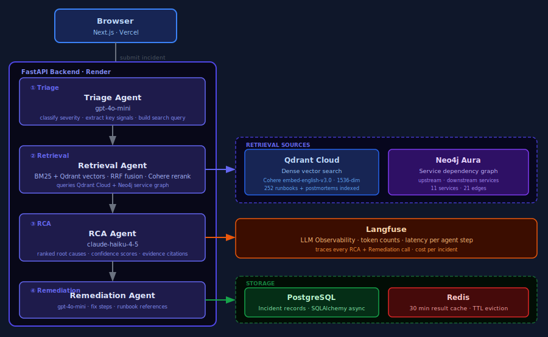
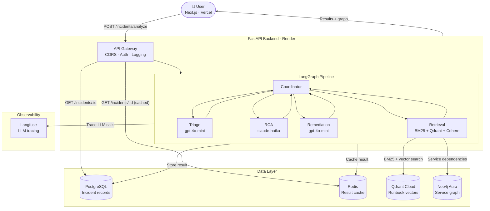

# RootCauseAnalysis

[](https://github.com/Mouryan-J/RootCause/actions/workflows/ci.yml)
[](https://www.python.org/)
[](https://rootcause-api.onrender.com)
[](https://root-cause-psi.vercel.app)

**Autonomous Incident RCA & Response Copilot**

A multi-agent AI system that investigates production incidents and produces ranked root cause hypotheses with evidence, automatically.

**Live demo:** https://root-cause-psi.vercel.app

---

## Features

- **Multi-agent RCA pipeline**: LangGraph supervisor routes through triage → retrieval → RCA → remediation agents in sequence
- **Hybrid RAG retrieval**: BM25 + Qdrant vector search fused with Reciprocal Rank Fusion, then Cohere reranked for precision
- **Service dependency graph**: Neo4j graph of upstream/downstream service relationships, visualized on the results page
- **Ranked root causes**: 1–3 hypotheses with confidence scores (0–100%), evidence citations, and contributing factors
- **Remediation steps**: concrete, numbered fix steps referencing matched runbooks
- **Live results polling**: results page updates every 2 seconds until analysis completes
- **Incident history**: browse all past incidents with severity, status, and relative timestamps
- **LLM observability**: every agent call traced in Langfuse with token counts and cost per incident
- **Redis caching**: completed analyses cached for 30 minutes, eliminating repeat DB hits
- **CI/CD**: GitHub Actions runs ruff lint and 27 pytest unit tests on every push

---

## Retrieval Evaluation

Evaluated on 50 queries across database, cache, and infrastructure categories with ground-truth runbook mappings.

| Metric | BM25-only | Hybrid (BM25 + Qdrant + Cohere) | Improvement |
|---|---|---|---|
| Recall@1 | 84.0% | 96.0% | **+12.0%** |
| Recall@3 | 92.0% | 98.0% | **+6.0%** |
| Recall@5 | 98.0% | 98.0% | +0.0% |
| MRR | 89.5% | 97.0% | **+7.5%** |

Hybrid retrieval surfaces the correct runbook as the **top result 96% of the time**, compared to 84% for BM25 alone.

> Run `uv run python scripts/run_eval.py` to reproduce.

---

## RCA Reasoning Evaluation

The retrieval benchmark above tests document search, not diagnosis — its queries reuse the target runbook's own wording, so a high score mostly proves the embedding/BM25 stack finds the right document. This benchmark tests diagnosis directly: 8 hand-authored incidents (`rca_eval_v2.jsonl`) across 7 failure classes — resource contention, feature-flag regressions, schema mismatches, dependency-version skew, cascading third-party latency, a cache-invalidation race — where the title and logs never name the failure mode, and every wrong candidate cause shares real evidence with the correct one rather than being an obvious miss. A separate LLM (not the one being graded) judges whether the top-ranked hypothesis names the actual mechanism.

**General reasoning**

| | Top-1 | Top-3 | Hallucination | Fallback |
|---|---|---|---|---|
| Bare LLM, no retrieval/graph | 100% (n=7) | 100% (n=7) | 7.1%\* | 12.5% |
| Full pipeline | 100% (n=8) | 100% (n=8) | 0.0% | 0.0% |

\* Checked by hand: both flagged citations were real evidence, not fabrications — see `docs/evaluation.md`.

A bare LLM call ties the full pipeline here. When the logs already name every service involved, the extra retrieval/graph/triage machinery doesn't change the verdict — so the next test removed that shortcut.

**Graph-dependency probe**

3 incidents (`rca_eval_graph_test.jsonl`) where the logs give only a *type* signature — a lock-wait-timeout implies a database, key-eviction implies a cache — and never name the dependency itself:

| | Named the actual dependency |
|---|---|
| Bare LLM | 0/3 — generic ("a downstream transactional store") |
| Full pipeline | 3/3 — specific ("lock contention on postgres") |

This is the one measured case where the dependency graph earns its place: it turns a type-correct guess into an actionable diagnosis. Full methodology, worked examples, and two production bugs this evaluation caught along the way are in [`docs/evaluation.md`](docs/evaluation.md).

> Run `uv run python scripts/run_rca_eval.py` to reproduce (makes real LLM calls).

---

## How it works

1. **Submit**: paste an incident title, affected service, severity, and raw logs into the form
2. **Triage**: the Triage agent (gpt-4o-mini) classifies severity and extracts key signals to build a search query
3. **Retrieve**: the Retrieval agent runs BM25 + Qdrant vector search in parallel, fuses the rankings with RRF, then Cohere reranks the top results; Neo4j is also queried for the service's upstream/downstream dependencies
4. **Analyze**: the RCA agent (claude-haiku) reads the retrieved runbooks and dependency context to produce 1–3 ranked root cause hypotheses with confidence scores and evidence citations
5. **Remediate**: the Remediation agent (gpt-4o-mini) writes numbered fix steps referencing the matched runbooks
6. **Result**: the page polls every 2 seconds and renders the full report once complete; the service dependency graph is visualized inline; the result is cached in Redis for 30 minutes

All past incidents are browsable in the history view.

---

## Architecture



<details>
<summary>Mermaid diagram</summary>



</details>

---

## Tech Stack

| Layer | Technology |
|---|---|
| Frontend | Next.js 15, Tailwind CSS, deployed on Vercel |
| Backend | Python 3.12, FastAPI, deployed on Render |
| AI orchestration | LangGraph (supervisor/worker multi-agent) |
| LLM | Claude Haiku via Anthropic API |
| RAG retrieval | BM25 (rank-bm25) + Qdrant Cloud vectors + Cohere rerank |
| Embeddings | Cohere embed-english-v3.0 |
| Database | PostgreSQL (SQLAlchemy async) |
| Cache | Redis (optional, graceful fallback) |
| Observability | OpenTelemetry + structlog |
| CI | GitHub Actions (ruff lint + pytest) |

---

## Project structure

```
rootcause/
├── src/rootcause/
│   ├── agents/          # LangGraph agents (triage, retrieval, rca, remediation, graph)
│   ├── api/             # FastAPI routes, schemas, middleware
│   ├── core/            # Config, security, telemetry (Langfuse)
│   ├── db/              # SQLAlchemy models, PostgreSQL, Redis, Neo4j clients
│   └── rag/             # Corpus loader, BM25 + Qdrant hybrid retriever
├── frontend/
│   └── src/
│       ├── app/         # Next.js pages (submit, results, history)
│       ├── components/  # ResultsPoller, ServiceGraphView, form components
│       └── lib/         # API client
├── data/
│   ├── corpus/          # 252 runbooks and postmortems (source documents)
│   └── eval/            # retrieval_eval.jsonl (50 queries) + rca_eval.jsonl (18 incidents, v1) + rca_eval_v2.jsonl (8 incidents, hardened schema)
├── scripts/
│   ├── seed_graph.py    # Populates Neo4j with 11 services + 21 dependency edges
│   ├── run_eval.py      # BM25 vs Hybrid retrieval benchmark
│   └── run_rca_eval.py  # RCA reasoning benchmark (bare LLM vs full pipeline, LLM-judged)
├── docs/
│   └── evaluation.md    # RCA reasoning eval methodology, results, worked failure cases
└── tests/unit/          # 27 unit tests (config, security, RAG, RCA parsing, grounding filter, retry/fallback logic)
```

---

## Running locally

**Prerequisites:** Python 3.12+, [uv](https://github.com/astral-sh/uv), Node.js 20+

```bash
# Clone
git clone https://github.com/Mouryan-J/RootCause.git
cd RootCause

# Backend
cp .env.example .env          # fill in API keys
uv sync --extra dev
uv run python -m rootcause.main

# Frontend (separate terminal)
cd frontend
npm install
npm run dev
```

**Required env vars** (see `.env.example`):

```
ANTHROPIC_API_KEY=...
DATABASE_URL=postgresql+asyncpg://...
QDRANT_URL=https://xxx.qdrant.io:6333
QDRANT_API_KEY=...
COHERE_API_KEY=...
```

---

## Running tests

```bash
uv run pytest tests/unit/ -v
uv run ruff check src/ tests/
```

27 unit tests covering config, security, RAG retrieval, and RCA agent parsing/grounding/retry logic.

